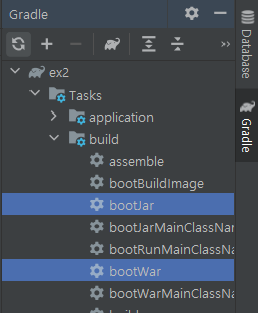

# 스프링부트 학습
* ## 교재
  * ### 코드로 배우는 스프링 부트 웹 프로젝트
* ## 목표기간
  * ### 2021.05.03 ~ 2021.06.20
 

 

## 학습내용
 

### 개발 환경 및 프로젝트 생성
* 개발환경
  * JDK 15.0.2 ver 사용
  * InteliJ Ultimate ver IDE 사용
* 프로젝트 생성
  * InteliJ Ultimate ver 사용할 경우에는 프로젝트를 통합 개발툴에 내장되어있는 기능으로 SpringBoot Initializer 사이트를 거치지 않고 생성이 가능하다
  * InteliJ Community ver 사용을 할 경우에는 https://start.spring.io/ 사이트를 이용하여 프로젝트를 생성하고 원하는 폴더에 압축을 풀어 생성한다
  * dependencies 메뉴에서 원하는 라이브러리를 선택하여 생성한다 ( Lombok, Spring Jpa, 등등)

### 프로젝트 실행
  * 기본적으로 스프링부트 프로젝트는 톰캣을 내장하고 있기 때문에 우측 상단에 Run 버튼을 눌러 실행하면 알아서 톰캣이 싱행되고 프로젝트가 해당 컨테이너에 올라간다
  * 스프링부트는 main() 메서드를 이용해서 실행된다 (Gradle 빌드일 경우)
  * Gradle이 설치된 경로에 한글이 포함될 경우 오류를 뿜어낸다 기본설치경로->(C:\users\계정\.gradle)

### 컨트롤러 생성
  
  * 메인이 되는 패키지에 controller 패키지를 추가한 뒤 SampleController.class 를 생성한다

  
  * 컨트롤러 클래스 정의 이전에 @RestController 어노테이션을 추가하여 별도의 화면구성 없이(View 반환 없이) 데이터를 전송하도록 클래스를 정의한다
  * hello() 메서드 정의 부분에 @GetMapping("/hello") 어노테이션을 추가하여 주소창에서 /hello 를 통해 호출 가능하도록 설정한다 (SERVLET의 @WebServelt() 기능)

  
  * localhost:8080/hello 를 통해 방금만든 컨트롤러를 호출한다
  * 정상적으로 JsonArray 문자열이 전달된것을 확인할 수 있다
  * 눈여겨 봐야 할 것이 기존 서블릿을 이용하여 프로젝트를 진행할때에는 JSON을 사용하기 위해서는 외부 라이브러리를 직접 넣어주어야 사용이 가능했는데 스프링부트는 별도의 설정없이도 Json 형태로 전송이 가능하다

### 프로젝트 배포 방법 (Export war, jar)
  * 톰캣을 내장하여 단독 실행가능한 어플리케이션 형태로 추출 할 경우에는 jar 파일로 추출
  * 별도의 톰캣 서버에 어플리케이션을 등록하여 배포하고자 할때에는 war 파일로 추출하여 톰캣 디렉터리에 추가해준다

  
  * jar 또는 war 파일로 추출하는 방법으로는 인텔리제이 우측탭의 Gradle을 클릭 -> 프로젝트명\Task\build\bootjar OR bootWar 실행
  * 해당 방법으로 배포용 파일을 생성할 수 있다 나의 경우에는 이미 구축된 톰캣 서버를 통해 배포하고 싶어 WAR파일 생성 후 톰캣 Webapps 디렉터리에 등록하니 문제없이 잘 실행되었다
####
    1강 복습완료 2021.05.03
    

